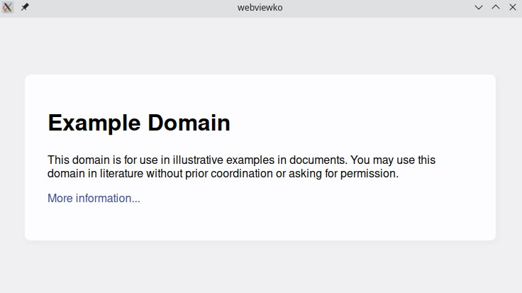

# webviewko


[](https://github.com/Winterreisender/webviewko/actions/workflows/gradle-ci.yml)


<!-- 
See [RFC4646](https://www.ietf.org/rfc/rfc4646.txt), [W3C language tags](https://www.w3.org/International/articles/language-tags/#bytheway) and [iana](https://www.iana.org/assignments/language-subtag-registry)
-->

**English** | [中文(简体)](docs/README.zh-Hans.md)

webviewko provides a Kotlin Multiplatform binding to [webview](https://github.com/webview/webview), a tiny cross-platform webview library to build modern cross-platform desktop GUIs using [WebView2](https://developer.microsoft.com/en-us/microsoft-edge/webview2/), WebKit and [WebKitGTK](https://webkitgtk.org/).



## Getting Started

### 1. Import webviewko

If you're using a build system like Gradle or Maven, it's recommended to import webviewko via [GitLab Packages](https://gitlab.com/Winterreisender/webviewko/-/packages/). 

For `build.gradle.kts`, just use:

```kotlin {3}
repositories {
    mavenCentral()
    maven("https://gitlab.com/api/v4/projects/38224197/packages/maven")
}

implementation("com.github.winterreisender:webviewko:0.5.0")            // Kotlin Multiplatform
implementation("com.github.winterreisender:webviewko-jvm:0.5.0")        // Kotlin/JVM and Java
implementation("com.github.winterreisender:webviewko-linuxx64:0.5.0")   // Kotlin/Native Linux x64
implementation("com.github.winterreisender:webviewko-mingwx64:0.5.0")   // Kotlin/Native Windows x64
implementation("com.github.winterreisender:webviewko-macosx64:0.6.0-RC1")   // Kotlin/Native macOS x64
implementation("com.github.winterreisender:webviewko-js:0.5.0")         // Kotlin/JS Node.js
```

- If you want to use jar files, see [GitHub Release](https://github.com/Winterreisender/webviewko/releases)  
- [Additional steps](https://github.com/Winterreisender/webviewko/wiki/How-to-Import#using-gradle-with-kotlinnative) are required for Kotlin/Native. 
- If you are using `JitPack.io` please move `maven("https://jitpack.io")` below `maven("https://gitlab.com/api/v4/projects/38224197/packages/maven")`

### 2. Use webviewko

```kotlin
import com.github.winterreisender.webviewko.WebviewKo

WebviewKo().run {
    title("Title")
    size(800, 600)
    url("https://example.com")
    show()
}
```

### 3. Interact with webview

You can use `bind`,`init`,`dispatch` and `eval` to interact with your webview:

```kotlin
import com.github.winterreisender.webviewko.WebviewKo

WebviewKo(1).run {
  title("Test")
  init("""console.log("Hello, from  init")""")
  bind("increment") {
    val r :Int = it.removePrefix("[\"").removeSuffix("\"]").toInt() + 1
    println(r.toString())
    if(r==8)
      terminate()
    "{count: $r}"
  }
  html("""
              <button id="increment">Tap me</button>
              <div>You tapped <span id="count">0</span> time(s).</div>
              <script>
              const [incrementElement, countElement] = document.querySelectorAll("#increment, #count");
                document.addEventListener("DOMContentLoaded", () => {
                  incrementElement.addEventListener("click", () => {
                    window.increment(countElement.innerText).then(result => {
                      countElement.textContent = result.count; });});});
               </script>""")
  show()
}
```

## Help

- [API Reference](https://winterreisender.github.io/webviewko/docs/kdoc/index.html)
- [GitHub Wiki](https://github.com/Winterreisender/webviewko/wiki)
- Examples
  - [Test](https://github.com/Winterreisender/webviewko/blob/main/src/commonTest/kotlin/Test.kt) (Kotlin Multiplatform)
  - [TestKt](https://github.com/Winterreisender/webviewko/blob/main/src/jvmTest/kotlin/TestKt.kt) (Kotlin/JVM)
  - [TestJava](https://github.com/Winterreisender/webviewko/blob/main/src/jvmTest/java/TestJava.java) (Java)
  - [TestJS](https://github.com/Winterreisender/webviewko/blob/main/src/jsTest/kotlin/TestJS.kt) (Kotlin/JS)
  - [TestNative](https://github.com/Winterreisender/webviewko/blob/main/src/nativeTest/kotlin/TestNative.kt) (Kotlin/Native)
- [webview Documentation](https://webview.dev/)
- Demo: A CLI Tool [Winterreisender/webviewkoCLI](https://github.com/Winterreisender/webviewkoCLI)

## Contribution

All suggestions, pull requests, issue and other contributions are welcome and appreciated.

## Credits

| Project                                                                      | License                                                                                          |
|------------------------------------------------------------------------------|--------------------------------------------------------------------------------------------------|
| [webview](https://github.com/webview/webview)                                | [MIT](https://github.com/webview/webview/blob/master/LICENSE)                                    |
| [webview_java](https://github.com/webview/webview_java)                      | [MIT](https://github.com/webview/webview_java/blob/main/LICENSE.md)                              |
| [webview-nodejs](https://github.com/Winterreisender/webview-nodejs)          | [Apache-2.0](https://github.com/Winterreisender/webview-nodejs/blob/master/LICENSE)              |
| [node-ffi-napi](https://github.com/node-ffi-napi/node-ffi-napi)              | [MIT](https://github.com/node-ffi-napi/node-ffi-napi/blob/master/LICENSE)                        |
| [JNA](https://github.com/java-native-access/jna)                             | [LGPL-2.1-or-later OR Apache-2.0](https://github.com/java-native-access/jna/blob/master/LICENSE) |
| [Microsoft Webview2](https://www.nuget.org/packages/Microsoft.Web.WebView2/) | [BSD-style](https://www.nuget.org/packages/Microsoft.Web.WebView2/1.0.1245.22/License)           |
| [Kotlin & kotlinx](https://kotlinlang.org/)                                  | [Apache-2.0](https://github.com/JetBrains/kotlin/blob/master/LICENSE)                            |

## License

```text
Copyright 2022 Winterreisender and other contributors.

Licensed under the Apache License, Version 2.0 (the "License");
you may not use this file except in compliance with the License.
You may obtain a copy of the License at
http://www.apache.org/licenses/LICENSE-2.0

Unless required by applicable law or agreed to in writing, software
distributed under the License is distributed on an "AS IS" BASIS,
WITHOUT WARRANTIES OR CONDITIONS OF ANY KIND, either express or implied.
See the License for the specific language governing permissions and
limitations under the License.
```