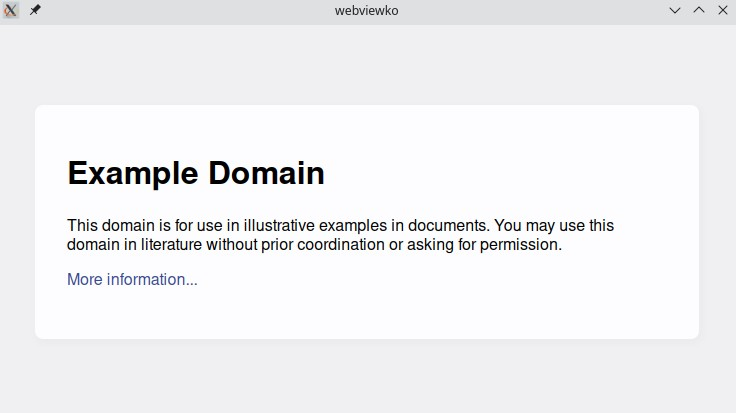

# webviewko


[](https://github.com/Winterreisender/webviewko/actions/workflows/gradle-ci.yml)


[English](../README.md) | [中文(简体)](README.zh-Hans.md) | **中文(繁體)**

webviewko 是一個 [webview](https://github.com/webview/webview) (輕量級跨平台的網頁視圖庫) 的 Kotlin 綁定, 支持 Java 和 Kotlin/Native.



## 快速開始

### 1. 導入 webviewko

如果你在用 Gradle 或者 Maven 等構建系統, 請看[GitHub Packages](https://github.com/Winterreisender?tab=packages&repo_name=webviewko)。


如果你想手動導入jar文件, 請到 [GitHub Release](https://github.com/Winterreisender/webviewko/releases) 下載。

### 2. 使用 webviewko

對於 Kotlin/JVM 和 Kotlin/Native:

```kotlin
import com.github.winterreisender.webviewko.WebviewKo

WebviewKo().run {
    title("Title")
    size(800, 600)
    url("https://example.com")
    show()
}
```

對於 Java:

```java
import com.github.winterreisender.webviewko.WebviewKo;

WebviewKo webview = new WebviewKo(0);
webview.title("Test");
webview.size(1024,768,WebviewKo.WindowHint.None);
webview.url("https://example.com");
webview.show();
```

### 3.與 webview 交互

可以用 `bind`,`init`,`dispatch` 和 `eval` 來和 webview 進行交互。

```kotlin
import com.github.winterreisender.webviewko.WebviewKo

WebviewKo().run {
    title("Test")
    init("""console.log("Hello, from  init")""")
    bind("increment") {
        val r :Int = Regex("""\["(\d+)"]""").find(it!!)!!.groupValues[1].toInt() + 1
        println(r.toString())
        if(r==8) terminate()
        "{count: $r}"
    }
  
    html("""<button id="increment">Tap me</button>
        <div>You tapped <span id="count">0</span> time(s).</div>
        <script>const [incrementElement, countElement] = document.querySelectorAll("#increment, #count");
          document.addEventListener("DOMContentLoaded", () => {
            incrementElement.addEventListener("click", () => {
              window.increment(countElement.innerText).then(result => {
                countElement.textContent = result.count;
              });});});
         </script>""")
    show()
}
```

<!-- You can also use JNA and Kotlin/Native bindings directly -->


## 文檔

- [API 參考 (KDoc)](https://winterreisender.github.io/webviewko/docs/kdoc/index.html)
- [GitHub Wiki](https://github.com/Winterreisender/webviewko/wiki)
- 示例
    - [Test](https://github.com/Winterreisender/webviewko/blob/main/src/commonTest/kotlin/Test.kt) (Kotlin/Multiplatform)
    - [TestKt](https://github.com/Winterreisender/webviewko/blob/main/src/jvmTest/kotlin/TestKt.kt) (Kotlin/JVM)
    - [TestJava](https://github.com/Winterreisender/webviewko/blob/main/src/jvmTest/java/TestJava.java) (Java)
    - [TestNative](https://github.com/Winterreisender/webviewko/blob/main/src/nativeTest/kotlin/TestNative.kt) (Kotlin/Native)
- [webview 的文檔](https://webview.dev/)

## 演示

命令行界面: [Winterreisender/webviewkoCLI](https://github.com/Winterreisender/webviewkoCLI)

## 貢獻

歡迎並感謝所有Issue, Pull Request和其他形式的貢獻。

## 引用

| 項目                                                                           | 許可                                                                                               |
|------------------------------------------------------------------------------|--------------------------------------------------------------------------------------------------|
| [wiverson/webviewjar](https://github.com/wiverson/webviewjar)                | [MIT](https://github.com/wiverson/webviewjar/blob/master/LICENSE)                                |
| [webview_csharp](https://github.com/webview/webview_csharp)                  | [MIT](https://github.com/webview/webview_csharp/blob/master/LICENSE)                             |
| [webview](https://github.com/webview/webview)                                | [MIT](https://github.com/webview/webview/blob/master/LICENSE)                                    |
| [JNA](https://github.com/java-native-access/jna)                             | [LGPL-2.1-or-later OR Apache-2.0](https://github.com/java-native-access/jna/blob/master/LICENSE) |
| [Microsoft Webview2](https://www.nuget.org/packages/Microsoft.Web.WebView2/) | [See the License](https://www.nuget.org/packages/Microsoft.Web.WebView2/1.0.1245.22/License)     |
| [Kotlin & kotlinx](https://kotlinlang.org/)                                  | [Apache-2.0](https://github.com/JetBrains/kotlin/blob/master/LICENSE)                            |

## 版權與許可

Copyright 2022 Winterreisender and [other contributors](https://github.com/Winterreisender/webviewko/graphs/contributors).

Licensed under the Apache License, Version 2.0 (the "License"); you may not use this file except in compliance with the License. You may obtain a copy of the License at http://www.apache.org/licenses/LICENSE-2.0  
Unless required by applicable law or agreed to in writing, software distributed under the License is distributed on an "AS IS" BASIS, WITHOUT WARRANTIES OR CONDITIONS OF ANY KIND, either express or implied.  
See the License for the specific language governing permissions and limitations under the License.

SPDX 許可證標識符: **Apache-2.0**


